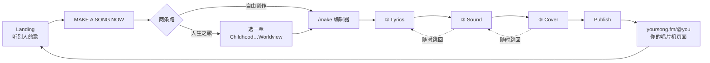

# YOURSONG · 产品文档

> 一句话：**把你的故事变成一首歌。**
> Landing 负责"让人听见"，App 负责"让人写出来"，唱片架负责"让人留下来"。

版本 v0.6 · 2026-08-17 · 状态：Landing 已上线可分享；Make a song 流程已梳理（人生之歌模版 + 三步编辑器），待拍板后开工
产品名：**YOURSONG**（原 ANSWER，2026-08-17 改名；分享域名 `yoursong.fm`）

---

## 0. 我对需求的理解（先对齐）

1. **Landing 和产品要拆开。** 点 "Make a song now" 是进入产品的实际使用界面（App），不是页面内的一段滚动。Landing 只做三件事：说清楚是什么、让人听到别人的歌、把人推进 App。
2. **Landing 上半部分要更简单、更高级。** 一屏一句话 + 一台唱片机 + 一个按钮，不堆信息。
3. **稍微下滑**就能看到其他用户写的小唱片，可以挑一张试听 —— 这部分保留现在的 3D 唱片架。
4. **播放时右侧出现一张"小纸条"**：这首歌是谁写的、他当时写下的 prompt 是什么。让人看到"原来一句话就能变成一首歌"。
5. **播放时下方出现一小段歌词**，跟着播放进度走。
6. 之后再一起设计：创作流程、发布流程（含唱片/唱片机外观选择）、付费系统。
7. 整体要求：**简单高级、流程简化，但闭环完整、足够成熟。**

---

## 1. 产品定位

| 维度 | 定义 |
| --- | --- |
| 是什么 | 一个 AI 写歌 agent：给它一句感受、一段回忆、半个念头，几分钟内拿到一首属于自己的歌 |
| 给谁 | 想表达但不会写歌的人：想送礼物、想纪念、想把情绪具象化 |
| 差异点 | 不是"生成一段音乐"，而是**一张有名字、有封面、有出处的唱片** —— 可收藏、可发布、可分享 |
| 情绪 | 安静、克制、有质感。黑胶、暗房、手写小纸条，而不是霓虹科技感 |

**核心闭环**：听见别人的歌 → 自己写一首 → 发布成唱片 → 被别人听见 → 循环。

---

## 2. 信息架构

```
Landing（公开，无需登录）
├─ 首屏：主张 + 唱片机 + CTA
├─ 唱片墙：别人发布的唱片，一排循环
│   └─ 点开：唱片上盘播放 + 故事面板 + 逐句歌词
└─ MAKE A SONG NOW ↓

进门（/make）
├─ 人生之歌  五章任选：Childhood · Youth · Family · Career · Worldview
└─ 自由创作  空白开始

编辑器（一个页面 + 顶部三格 step）
├─ ① Lyrics   说这首歌 → AI 写词 → 你改
├─ ② Sound    选 feeling → 三版 demo → 微调
├─ ③ Cover    三张封面 / 上传照片
└─ Publish ↓  （右上角常驻）

你的页面（yoursong.fm/@you）
├─ 你的唱片机（5 种外观）+ 你的唱片架（3 种排版）
├─ 单曲分享页 /@you/<slug>
└─ Made with YOURSONG → 回流 Landing
```


导航原则：Landing 只有一个主动作（Make a song now）。App 内只有一个主动作（写下一句）。任何时候屏幕上不出现第二个同等权重的按钮。

---

## 3. Landing Page 规格（已实现）

还原 Figma 画板「Your song」的三帧：`song → song2 → song3`（1280 × 830）。
全站只有一块固定的 3D 画布，所有位置按画板的相对坐标定位，任何窗口比例下版式一致。

### 3.1 第一屏（song）

| 元素 | 规格 |
| --- | --- |
| 背景 | `#d9d9d9 → #737373` 竖向渐变 |
| 品牌 | `Your Song`，左上 24/24 |
| 主标题 | `TURN YOUR STORY INTO A SONG.` Iosevka，画板 40px |
| 副文案 | 502px 宽两行，画板 16px |
| 3D | 只有唱片机，居中（画板 u=0.50 / v=0.523），唱片已经在盘上 |
| CTA | `MAKE A SONG NOW` 半透明胶囊，居中偏下（v≈0.79） |

> 字号说明：Iosevka 比画板用的 Iosevka Charon 宽约 13%，所以字号统一 ×0.887，
> 保证文字块宽度与画板一致。

### 3.2 下滑（song2）

按顺序发生，互不重叠：

1. `stage 0 → 0.5`：CTA 一路飞到右上角并缩小（195 × 60），主标题与副文案淡出上移
2. `stage 0.4 → 1`：唱片机上移到 v=0.268
3. `stage 0.42 → 1`：八张唱片从下方升起，排成**平面的一排**（同一深度、同一大小，每张 ≈ 画面宽 24%）

这一排从右往左匀速缓慢平移，走出画面就从右侧绕回来，无限循环；也可以左右拖动手动拨。
鼠标停在某张上时几乎停下，方便点；空中的唱片不自转，保证盘面上的标题可读。

### 3.3 点一张唱片（song3）

- 唱片机滑到左侧（u=0.311），这一排唱片整体下沉到画面底边（平移放慢到 45%）
- 被点的那张飞上唱盘 → 唱臂压下 → 33⅓ 转速旋转 → 出声
- 右侧升起白色圆角面板（画板 392 × 454，u=0.623 / v=0.206）：
  编号 · SIDE A/B · 日期 / 大标题 / 用户当时讲的那段故事 / 进度条 + 上一首 · 播放 · 下一首 / 作者 handle
- 退出：面板右上角 ×、Esc，或点另一张唱片直接换歌

### 3.4 唱片素材

八张唱片直接用 Figma 里导出的成品 picture disc（`assets/covers/01..08.png`，516 × 512，
标题弧排 + SIDE A/B + STEREO 33⅓ + 中心白标），3D 里叠一层沟槽粗糙度贴图产生扫光。
文案（标题 + 故事）与画板一一对应。

### 3.5 音频与歌词

- 有真音频的唱片放真音频：把文件丢进 `assets/songs/`，命名跟唱片图一致（`01-first-summer.mp3`）即可，无需改代码
- 没有文件的唱片继续用本地合成器（seed 决定调式、速度与编配，含黑胶底噪）
- 歌词按优先级取：同名 `.lrc`（带时间轴）→ 同名 `.txt` → mp3 自带的 ID3 USLT 帧（Suno 导出自带）
- 播放时唱片机下方显示**当前这一句**，小字、淡入淡出；有时间轴按时间轴，没有就按时长均分
- 面板时长直接读文件；唱针进度按真实时钟走，暂停/续播保留位置
- 当前已上线：FIRST SUMMER = Golden Hours（Suno，60 秒试听版），歌词 8 句

### 3.6 规则

| 项 | 规则 |
| --- | --- |
| 文案语言 | 英文（与 Figma 一致），中文版后续做 |
| 动效 | 一切位移用阻尼插值，不用生硬 easing |
| 降级 | `prefers-reduced-motion` 时关掉平滑滚动 |
| 音频 | 首次播放必须由用户手势触发；被拦截时挂一次性手势监听补播 |
| 窄屏 | 相机按 aspect 自动后退；面板落到底部通栏 |

> 本次按你的要求只做 Landing：写歌 App 那套（`js/agent.js`、`js/ui/Studio.js`、
> `js/ui/Nowbar.js`）留在仓库里但已从入口摘掉，等 App 的交互定了再接回来。

---

## 4. Make a song：完整流程

### 4.0 骨架

参考 intro3d 的产品结构（不是它的视觉）：**浏览永远免费 → 创作要账号 → AI 步骤烧 credit → 终点是一个可分享的个人页面**。

更关键的是它的**形态**：不是五个前后翻页的向导，而是**一个编辑器 + 顶部三格 step**。左边是当前步的全部控件，右边的预览一直在，随时能跳回上一步改。我们照抄这个形态，把内容换成唱片：

| intro3d | YOURSONG |
| --- | --- |
| ① Model 上传照片 → AI 出形象 | ① **Lyrics** 说这首歌 → AI 写词 |
| ② Stickers 贴纸库往模型上贴 | ② **Sound** 选 feeling → 出三版 demo |
| ③ Animation 编排镜头 + 时间轴 | ③ **Cover** 出三张封面 / 上传照片 |
| Publish → 你的 3D 主页 | Publish → 你的唱片机页面 |



### 4.05 进门：两条路

点 `MAKE A SONG NOW` 之后先做一个选择，然后才进编辑器。

| 路线 | 是什么 | 给谁 |
| --- | --- | --- |
| **人生之歌**（默认，推荐） | 五张唱片拼成一生：Childhood · Youth · Family · Career · Worldview。选一章开始，其余的位置先空着 | 第一次来的人。不用想"我要写什么"，只要挑一段人生 |
| **自由创作**（Create new） | 空白开始，写任何一首 | 已经做过一张、心里有具体念头的人 |

**选章节**这一屏（= 截图那版）：五张唱片横排，每张有名字和一句话，选中的那张卡片描边加深。
下面一行五个圆点代表进度：`Your life, five records. Start anywhere.`

每一章会换掉编辑器里的引子卡和 agent 的追问，用户不用面对空白：

| 章节 | 引子（点一张就有半句） |
| --- | --- |
| Childhood | 家里的味道 · 一个夏天 · 最早的一件事 · 那时候的大人 |
| Youth | 第一次离开 · 一个朋友 · 考砸的那次 · 十七岁的房间 |
| Family | 一顿饭 · 一个习惯 · 说不出口的一句 · 你像谁 |
| Career | 第一份工资 · 撑不下去那天 · 做成的一件事 · 现在的意义 |
| Worldview | 你信什么 · 改变你的一本书/一个人 · 想留下什么 |

规则：
- 五章**可以任意顺序**做，也可以只做一张就走
- 每章不限一首：同一章的第二首自动进 **SIDE B**（A 面是主打，B 面是补充）
- 自由创作的歌不占五章的位，单独放在架子上

---

### 4.1 界面骨架（三步共用）

```
┌───────────────────────────────────────────────────────────────────────┐
│ ‹ My records │ FIRST SUMMER      ① Lyrics ─ ② Sound ─ ③ Cover      Public page ↗ │
│              │ Auto-saved                                    [ Publish ]  ⚙   │
├──────────────┴────────────────────────────────────────────────────────┤
│  左栏 320px            │  舞台                                          │
│  当前这一步的全部控件   │  唱片机 + 唱片，一直在转                        │
│  以「选卡片」为主       │  跟 Landing 同一套 3D —— 做的过程和别人听到的     │
│  打字为辅              │  样子是同一个东西，不是两套界面                   │
│                       │                                               │
│  [ 生成按钮 ⚡60 ]     │                                               │
└───────────────────────┴───────────────────────────────────────────────┘
```

四条规矩（都是从 intro3d 那几屏抄的，很实用）：

1. **顶部三格 step 常驻**，做到第三步也能一键跳回第一步改词——不是单向向导
2. **每个花钱的按钮上直接印价**：`Make three versions ⚡60`，旁边显示余额，不做事后扣费
3. **Auto-saved** 挂在标题下面，关掉浏览器不丢
4. **右上角常驻 `Public page ↗` 和 `Publish`**：发布后按钮变 `Unpublish`，随时能看线上那版

### 4.2 模版化：能选就不要打字

这是「简单点」的关键。除了第一步那句话，全程尽量不让用户面对空输入框：

| 位置 | 模版化的做法 |
| --- | --- |
| 说这首歌 | 6 张引子卡：*a person · a place · a year · a goodbye · a first time · an ordinary day*，点一张，输入框里就有了半句，接着补 |
| 歌词结构 | 三个模版：**Story**（主歌-副歌-主歌-尾声）· **Letter**（写给某人）· **Short**（副歌 + 一段，30 秒） |
| feeling | 6 张卡，每张有 4 秒预听 |
| 声音 | 三个按钮：女声 / 男声 / 器乐 |
| 封面 | 4 种风格预设：**Film**（胶片颗粒）· **Sun**（过曝暖调）· **Night**（冷蓝）· **Paper**（版画） |

---

### Step ① Lyrics

**左栏**

- 大输入框：*What should this song be about?* + 6 张引子卡
- Agent 最多追问 **2 句**（写给谁 / 什么时候 / 听完想有什么感觉），聊完自动收起成三行摘要
- 歌词模版选择：Story / Letter / Short
- `Write the lyrics ⚡0`（首次免费）

**舞台**：歌词逐句流式打在唱片上方，像写在纸上；下方给 3 个标题候选

**改词**：就地编辑任意一句 · `Rewrite this section ⚡1` · `Try again ⚡3`
段落级重写就够了，不做逐句 AI 按钮——每句一个按钮会让人卡在这一步出不去。

**出口**：`These are my words →`

> 未登录也能走完这一步。歌词是这个产品最便宜、最有说服力的甜头，先给再要账号。

---

### Step ② Sound

**左栏**

- 6 张 feeling 卡（Lo-fi / Indie folk / Ballad / City pop / Synth pop / Acoustic），hover 播 4 秒预听（预渲染，不烧 credit）
- 声音：女声 / 男声 / 器乐
- 速度：慢一点 / 刚好 / 快一点
- `Make three versions ⚡60`

**舞台**：三张唱片浮在唱片机上方，A / B / C。点哪张哪张落到盘上转起来、开始唱，歌词跟着走。生成中唱片机空转、唱针待机——不做假进度条。

**微调**（每张唱片下面）：`Slower` `Brighter` `Sadder` `Different voice` — 每次 ⚡20
**再来一批**：`Three more ⚡60`，旧版本仍可回听，最多留 9 版，`♥` 标记喜欢的

> 微调**只改编曲、不重写词**。词是用户已经确认过的东西，被悄悄改掉最伤信任。

**出口**：`This is the one →`

---

### Step ③ Cover

**左栏**

- 4 种风格预设：Film / Sun / Night / Paper
- **上传照片**（可选）：用你自己的照片做底，AI 只做调色、颗粒、压片质感
- 正反面：SIDE A / SIDE B
- `Make three covers ⚡15`

**舞台**：三张封面**直接以唱片本体的样子**出现（标题弧排 + SIDE A + STEREO 33⅓，就是 Landing 上那种 picture disc），转着给你看，点一张选定。

> 上传照片这条要显眼。这是「这张唱片是我的」从概念变成事实的一步，也是最容易被发出去的一步。

**出口**：`Press it` → 压片动画，唱片落进唱盘

---

### 4.3 做好了

一张唱片 = 标题 + 词 + 音频 + 封面 + 那句原话 + 编号（`YS-0142`）+ SIDE A/B。

这一屏只有唱片在转 + 四个按钮：

| 按钮 | 行为 |
| --- | --- |
| **Publish** | 主动作 —— 见 5. |
| Download | mp3 + 封面图（付费） |
| Keep private | 只留在自己的架子上，不进公共墙 |
| Make another | 带着同一个 feeling 再写一首 |

## 5. Publish：你自己的唱片机页面

这是整个产品的落点，也是 intro3d 那种「工具感」的来源——**你得到的不是文件，是一个能发给别人的地址**。

### 5.1 发布流程

1. 起一个 handle：`yoursong.fm/@mira`（第一次发布时定，之后可改一次）
2. 可见性：**Public**（进 Landing 公共墙）/ **Unlisted**（有链接就能听）/ **Private**
3. 压片动画 → 唱片落进你的架子 → 直接跳到你的页面

第一次发布完，页面上多出一个 `Customize`，这是他"装修自己房间"的地方：

**唱片机外观**（5 种，先做完免费，后面再考虑锁）

| | |
| --- | --- |
| Matte Black | 现在这台，哑光黑（默认） |
| Silver | 银灰金属拉丝 |
| Wood | 木纹机身 + 米色底盘 |
| Acrylic | 半透明亚克力，能看见里面 |
| Paper White | 纸白 + 橙色按钮 |

**页面排版**（3 种模版）

| 模版 | 长什么样 | 适合 |
| --- | --- | --- |
| **Deck**（默认） | 唱片机居中，唱片一排在下面循环 —— 就是现在 Landing 那套 | 1–5 张 |
| **Timeline** | 按人生章节从左到右排成一条线，滚动像翻一生 | 做满五章的人 |
| **Shelf** | 唱片墙，网格铺开，点一张才飞上唱机 | 10 张以上 |

排版和外观都是**即选即预览**，右上角 `Publish` 才真正生效。

### 5.2 你的页面长什么样

跟 Landing 同一套 3D，但**唱片机是你的、唱片是你的**：

- 你的唱片机居中，你的唱片排成一排在下方（一张也成立）
- 点唱片 → 上盘、旋转、出声、歌词跟着走、右侧是你写这首歌时讲的那段话
- 顶部：你的 handle + 一句 bio；底部：`Made with YOURSONG` → 回流入口
- 分享单曲：`yoursong.fm/@mira/first-summer` —— 打开只有这一张，带 OG 图（唱片封面）和 30 秒试听

### 5.3 页面之后能加什么（先记着，不做）

| 项 | 说明 |
| --- | --- |
| 自定义域名 | Pro 起，对标 intro3d |
| 访问统计 | 播放数 / 完播率 / 来源 |
| 嵌入 | 一段 iframe，塞进 Notion、个人站 |
| 实体化 | 二维码卡片 / 唱片封套 / 真实压片 |

## 6. Credit 与付费（草案）

浏览与试听**永远免费**，创作按 credit 计费——这样"改到满意"这件事有明确价格，用户也不会被次数制卡在半路。

### 6.1 一首歌花多少

| 动作 | credit | 说明 |
| --- | --- | --- |
| 写词（首次） | 0 | 含在流程里，未登录也能看到 |
| 重写一段 | 1 | |
| 整首词重来 | 3 | |
| 生成三版 demo | 60 | 主要成本在这 |
| 单张 demo 微调重做 | 20 | Slower / Brighter / Sadder / Different voice |
| 生成三张封面 | 15 | 上传照片同价 |
| 发布 | 0 | |

**一首歌一次做完 ≈ 75 credit**；改两轮 demo、换一批封面 ≈ 170。

### 6.2 方案

| 方案 | 价格 | 内容 |
| --- | --- | --- |
| Free | $0 | 100 credit（够完整做一首）· 发布 1 张 · 公共链接 · 带片头水印 · 不能下载 |
| Plus | $10 / 月 | 1,000 credit ≈ 12 首 · 无限发布 · 无水印 · 下载 mp3 · 自定义 handle · 全部唱片机外观 |
| Studio | $20 / 月 | 2,500 credit ≈ 30 首 · 生成优先级 · 自定义域名 · 访问统计 · 商用授权 |
| 加油包 | $5 | 500 credit，不过期，任何方案可买 |

要点：
- **免费额度必须够完整做完一首并听到**，否则闭环断在最有说服力的位置（这也是 intro3d 的做法：免费能发布，AI 生成才要钱）
- 付费墙放在"下载 / 无水印 / 域名 / 更多次重做"，不放在"能不能做出第一首"
- 每个花钱按钮上直接写 `Make three versions · 60 credits · you have 840`，不做事后扣费

## 7. 数据模型

```js
Draft {                        // 创作中，逐步长成 Record
  id, userId|null, step,       // 1..5，决定回来时落在哪一屏
  brief,                       // Step 1 用户的原话（将来纸条上那句）
  chat[],                      // agent 最多 2 轮追问
  lyrics{ title, titleOptions[], sections[{kind, lines[]}] },
  feeling{ vibe, voice, tempo },
  demos[{ id, url, params, liked }],   // 最多 9 版
  chosenDemoId,
  covers[{ id, url, source }], // source: ai | photo
  chosenCoverId,
  spent                        // 这首歌已经烧掉的 credit
}

Record {                       // 发布后
  id, catalog,                 // YS-0142
  userId, handle, slug,        // yoursong.fm/@mira/first-summer
  title, lyrics, audioUrl, coverUrl, side,
  brief, feeling, visibility,  // public | unlisted | private
  plays, createdAt
}

User { id, handle, bio, deckSkin, plan, credits }
```

当前 Landing 是前端内存假数据。上线要补：账号、Draft/Record 存储、音频与封面的生成队列 + CDN、credit 账本、播放计数。

## 8. 技术架构（现状）

- **无构建**：importmap + ESM，本机没有 Node 也能跑
- Vue 3（含运行时编译器） + **TresJS**（Three.js 的 Vue 渲染器）
- 3D：程序化建模（唱片机 / 唱片）+ 画布生成贴图（沟槽、标签、封面）+ RoomEnvironment 环境光
- 音频：Web Audio 本地合成器（pad / bass / arp / kick / hat / 黑胶噪声 + 卷积混响）
- 歌词：本地模板生成器 `js/agent.js` —— 接真实模型时只替换 `writeLyrics()`，返回结构不变
- 唱片素材：`assets/covers/*.png`，Figma 导出的成品 picture disc，直接当贴图
- 目录：`index.html · css/app.css · js/{main,store,audio,textures,actions}.js · js/scene/* · js/ui/App.js`
- 本地预览：`python3 ~/answer-song-studio/serve.py`（端口 8480，响应带 `no-store`，避免浏览器缓存旧模块）
- 仓库：https://github.com/Belendali/yoursong
- **在线 demo：https://belendali.github.io/yoursong/** （GitHub Pages，main 分支根目录，push 即自动重建）
- 静态托管没有 serve.py 的 `/songs.json`，改读 `assets/songs/index.json`；加了歌之后跑 `python3 tools/index-songs.py` 重新生成

---

## 9. 里程碑

| 阶段 | 内容 | 状态 |
| --- | --- | --- |
| M1 | Landing：首屏 + 3D 唱片架 + 试听 | ✅ 已完成 |
| M2 | Landing：按 Figma「Your song」还原三帧 + 八张真唱片 | ✅ 已完成 |
| M3 | Landing：真音频 + 逐句歌词 + 上线可分享 | ✅ 已完成 |
| M4 | Make a song：三步编辑器走通（先用假生成，把交互和节奏定下来） | ⏭ 下一步 |
| M5 | 接真实生成：写词模型 + 音乐模型 + 封面模型 + 生成队列 | 待设计 |
| M6 | Publish + 个人唱片机页面 + 单曲分享页 | 待设计 |
| M7 | 账号 · credit 账本 · 付费 · 统计 | 待设计 |

**M4 建议的做法**：整条流程先用现成素材跑通——写词用模板、demo 用现有的合成器出三版、封面用现有的 8 张图轮换。
先把「三格 step、左栏控件、按钮上的 credit、等待时唱片机怎么转」这些体感调对，再把三个模型接进去。流程对了，换引擎只是替换函数。

## 10. 需要你拍板的问题

**关于流程**

1. Step ① 的 agent 追问，**2 句上限**你接受吗？还是干脆一句都不问，写完直接生成？
2. 写词之后选 feeling（现在这个顺序）—— 还是反过来先定风格再写词？我建议保持现在这样。
3. 三版 demo 是**同一首歌的三种编曲**，还是三种完全不同的走向（不同 feeling）？我建议同一首的三种编曲，差异太大反而选不出来。
4. 未登录能走到第几步？我建议 Step ① 走完（看到歌词），进 Step ② 前要账号。

11. 人生五章就定 Childhood / Youth / Family / Career / Worldview 这五个吗？还是加一个 **Love**（六章）？
12. 五章做满之后给什么？我建议给一张「合辑封面」+ 一个整生连播的模式，这是回访的钩子。

**关于生成**

5. 音乐用哪家？Suno / Udio / ElevenLabs Music，还是先自己接一个？这决定了 demo 的等待时间和 credit 定价。
6. 歌词模型：直接用 Claude 就行，还是要专门调？
7. 一首歌的长度：60 秒试听 + 完整版付费下载，还是直接给完整版？

**关于商业**

8. Free 给 100 credit（够完整做一首）你同意吗？
9. 个人页面的自定义域名放 Studio（$20）还是 Plus（$10）？
10. 用户上传照片做封面 —— 隐私与版权的说明要怎么写，要不要限制人脸？
