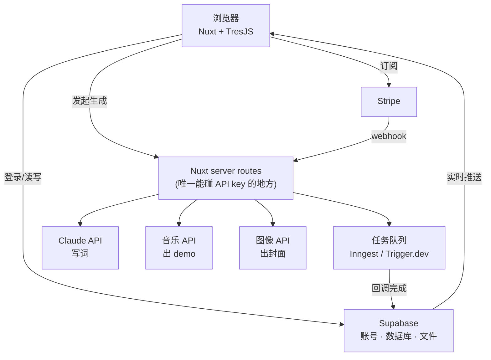

# YOURSONG · 产品文档

> 一句话：**把你的故事变成一首歌。**
> Landing 负责"让人听见"，App 负责"让人写出来"，唱片架负责"让人留下来"。

版本 v0.9 · 2026-08-17 · 状态：Landing 已上线；Make a song 流程 · 质感 · 技术方案已定；P0 任务已拆到条目，等你装 Node 就开工
产品名：**YOURSONG**（原 ANSWER，2026-08-17 改名；分享域名 `yoursong.fm`）

---

## 0. 我对需求的理解（先对齐）

1. **Landing 和产品要拆开。** 点 "Make a song now" 是进入产品的实际使用界面（App），不是页面内的一段滚动。Landing 只做三件事：说清楚是什么、让人听到别人的歌、把人推进 App。
2. **Landing 上半部分要更简单、更高级。** 一屏一句话 + 一台唱片机 + 一个按钮，不堆信息。
3. **稍微下滑**就能看到其他用户写的小唱片，可以挑一张试听 —— 这部分保留现在的 3D 唱片架。
4. **播放时右侧出现一张"小纸条"**：这首歌是谁写的、他当时写下的 prompt 是什么。让人看到"原来一句话就能变成一首歌"。
5. **播放时下方出现一小段歌词**，跟着播放进度走。
6. 之后再一起设计：创作流程、发布流程（含唱片/唱片机外观选择）、付费系统。
7. 整体要求：**简单高级、流程简化，但闭环完整、足够成熟。**

---

## 1. 产品定位

| 维度 | 定义 |
| --- | --- |
| 是什么 | 一个 AI 写歌 agent：给它一句感受、一段回忆、半个念头，几分钟内拿到一首属于自己的歌 |
| 给谁 | 想表达但不会写歌的人：想送礼物、想纪念、想把情绪具象化 |
| 差异点 | 不是"生成一段音乐"，而是**一张有名字、有封面、有出处的唱片** —— 可收藏、可发布、可分享 |
| 情绪 | 安静、克制、有质感。黑胶、暗房、手写小纸条，而不是霓虹科技感 |

**核心闭环**：听见别人的歌 → 自己写一首 → 发布成唱片 → 被别人听见 → 循环。

---

## 2. 信息架构

```
Landing（公开，无需登录）
├─ 首屏：主张 + 唱片机 + CTA
├─ 唱片墙：别人发布的唱片，一排循环
│   └─ 点开：唱片上盘播放 + 故事面板 + 逐句歌词
└─ MAKE A SONG NOW ↓

我的唱片架（/make · 也是登录后的首页）
├─ 六个章节：Childhood · Youth · Love · Family · Career · Worldview
└─ 第六格（虚线 ＋）：Create one by myself

编辑器（一个页面 + 顶部三格 step）
├─ ① Lyrics   说这首歌 → AI 写词 → 你改
├─ ② Sound    选 feeling → 三版 demo → 微调
├─ ③ Cover    三张封面 / 上传照片
└─ Publish ↓  （右上角常驻）

你的页面（yoursong.fm/@you）
├─ 你的唱片机（5 种外观）+ 你的唱片架（3 种排版）
├─ 单曲分享页 /@you/<slug>
└─ Made with YOURSONG → 回流 Landing
```


导航原则：Landing 只有一个主动作（Make a song now）。App 内只有一个主动作（写下一句）。任何时候屏幕上不出现第二个同等权重的按钮。

---

## 3. Landing Page 规格（已实现）

还原 Figma 画板「Your song」的三帧：`song → song2 → song3`（1280 × 830）。
全站只有一块固定的 3D 画布，所有位置按画板的相对坐标定位，任何窗口比例下版式一致。

### 3.1 第一屏（song）

| 元素 | 规格 |
| --- | --- |
| 背景 | `#d9d9d9 → #737373` 竖向渐变 |
| 品牌 | `Your Song`，左上 24/24 |
| 主标题 | `TURN YOUR STORY INTO A SONG.` Iosevka，画板 40px |
| 副文案 | 502px 宽两行，画板 16px |
| 3D | 只有唱片机，居中（画板 u=0.50 / v=0.523），唱片已经在盘上 |
| CTA | `MAKE A SONG NOW` 半透明胶囊，居中偏下（v≈0.79） |

> 字号说明：Iosevka 比画板用的 Iosevka Charon 宽约 13%，所以字号统一 ×0.887，
> 保证文字块宽度与画板一致。

### 3.2 下滑（song2）

按顺序发生，互不重叠：

1. `stage 0 → 0.5`：CTA 一路飞到右上角并缩小（195 × 60），主标题与副文案淡出上移
2. `stage 0.4 → 1`：唱片机上移到 v=0.268
3. `stage 0.42 → 1`：八张唱片从下方升起，排成**平面的一排**（同一深度、同一大小，每张 ≈ 画面宽 24%）

这一排从右往左匀速缓慢平移，走出画面就从右侧绕回来，无限循环；也可以左右拖动手动拨。
鼠标停在某张上时几乎停下，方便点；空中的唱片不自转，保证盘面上的标题可读。

### 3.3 点一张唱片（song3）

- 唱片机滑到左侧（u=0.311），这一排唱片整体下沉到画面底边（平移放慢到 45%）
- 被点的那张飞上唱盘 → 唱臂压下 → 33⅓ 转速旋转 → 出声
- 右侧升起白色圆角面板（画板 392 × 454，u=0.623 / v=0.206）：
  编号 · SIDE A/B · 日期 / 大标题 / 用户当时讲的那段故事 / 进度条 + 上一首 · 播放 · 下一首 / 作者 handle
- 退出：面板右上角 ×、Esc，或点另一张唱片直接换歌

### 3.4 唱片素材

八张唱片直接用 Figma 里导出的成品 picture disc（`assets/covers/01..08.png`，516 × 512，
标题弧排 + SIDE A/B + STEREO 33⅓ + 中心白标），3D 里叠一层沟槽粗糙度贴图产生扫光。
文案（标题 + 故事）与画板一一对应。

### 3.5 音频与歌词

- 有真音频的唱片放真音频：把文件丢进 `assets/songs/`，命名跟唱片图一致（`01-first-summer.mp3`）即可，无需改代码
- 没有文件的唱片继续用本地合成器（seed 决定调式、速度与编配，含黑胶底噪）
- 歌词按优先级取：同名 `.lrc`（带时间轴）→ 同名 `.txt` → mp3 自带的 ID3 USLT 帧（Suno 导出自带）
- 播放时唱片机下方显示**当前这一句**，小字、淡入淡出；有时间轴按时间轴，没有就按时长均分
- 面板时长直接读文件；唱针进度按真实时钟走，暂停/续播保留位置
- 当前已上线：FIRST SUMMER = Golden Hours（Suno，60 秒试听版），歌词 8 句

### 3.6 规则

| 项 | 规则 |
| --- | --- |
| 文案语言 | 英文（与 Figma 一致），中文版后续做 |
| 动效 | 一切位移用阻尼插值，不用生硬 easing |
| 降级 | `prefers-reduced-motion` 时关掉平滑滚动 |
| 音频 | 首次播放必须由用户手势触发；被拦截时挂一次性手势监听补播 |
| 窄屏 | 相机按 aspect 自动后退；面板落到底部通栏 |

> 本次按你的要求只做 Landing：写歌 App 那套（`js/agent.js`、`js/ui/Studio.js`、
> `js/ui/Nowbar.js`）留在仓库里但已从入口摘掉，等 App 的交互定了再接回来。

---

## 4. Make a song：完整流程

### 4.0 骨架

参考 intro3d 的产品结构（不是它的视觉）：**浏览永远免费 → 创作要账号 → AI 步骤烧 credit → 终点是一个可分享的个人页面**。

更关键的是它的**形态**：不是五个前后翻页的向导，而是**一个编辑器 + 顶部三格 step**。左边是当前步的全部控件，右边的预览一直在，随时能跳回上一步改。我们照抄这个形态，把内容换成唱片：

| intro3d | YOURSONG |
| --- | --- |
| ① Model 上传照片 → AI 出形象 | ① **Lyrics** 说这首歌 → AI 写词 |
| ② Stickers 贴纸库往模型上贴 | ② **Sound** 选 feeling → 出三版 demo |
| ③ Animation 编排镜头 + 时间轴 | ③ **Cover** 出三张封面 / 上传照片 |
| Publish → 你的 3D 主页 | Publish → 你的唱片机页面 |


### 4.05 进门：先看见自己的人生唱片架

点 `MAKE A SONG NOW` 之后**不问任何问题**，直接把架子摊开给他看——这是整个产品的核心画面，越早看到越好。

```
                     YOUR LIFE, IN SIX RECORDS
              Each theme is a side of your story. Start anywhere.

   ┌────────┐  ┌────────┐  ┌────────┐      ┌╌╌╌╌╌╌╌╌┐
   │Childhood│  │ Youth  │  │  Love  │      │   ＋    │
   │where it │  │the     │  │the ones│      │Your own │
   │ began   │  │learning│  │你心动的 │      │anything │
   └────────┘  └────────┘  └────────┘      │you want │
   ┌────────┐  ┌────────┐  ┌────────┐      └╌╌╌╌╌╌╌╌┘
   │ Family │  │ Career │  │Worldview│
   │the ones│  │building│  │how you  │
   │ who... │  │your path│  │see it all│
   └────────┘  └────────┘  └────────┘

                    ● ○ ○ ○ ○ ○   1 of 6 pressed
```

**六章 + 一格空的。** 章节顺序按人生走：Childhood → Youth → **Love** → Family → Career → Worldview。
空的那格是"自己写一首"——虚线描边、中间一个 `＋`、盘面是没刻纹的素胶片，一眼看出跟前六张不是一类，位置单独放在右边（或宽屏时放在一排的最后）。

不用先问"你要模版还是自由"，两条路直接摆在同一屏上，点哪个是哪个。

**这一屏同时也是他的家。** 做过的章节，卡片换成他自己的封面、鼠标停上去就放 8 秒；没做的还是空盘。以后从 Landing 或书签回来，落地的就是这一屏（`My records`）。

| 卡片状态 | 长什么样 |
| --- | --- |
| 没做过 | 黑胶素盘 + 章节名 + 一句话 |
| 做过了 | 他自己的封面 · hover 播 8 秒 · 角标 `SIDE A` |
| 做过两首以上 | 卡片右下角叠一张，标 `+2` |
| 锁住（免费用户用掉那一张后） | 盘面压暗 + 一把小锁，点了弹升级 |

每一章会换掉编辑器里的引子卡和 agent 的追问，用户不用面对空白：

| 章节 | 引子（点一张就有半句） |
| --- | --- |
| Childhood | 家里的味道 · 一个夏天 · 最早的一件事 · 那时候的大人 |
| Youth | 第一次离开 · 一个朋友 · 考砸的那次 · 十七岁的房间 |
| **Love** | 第一次心动 · 那个夏天的人 · 分开那天 · 现在枕边的人 |
| Family | 一顿饭 · 一个习惯 · 说不出口的一句 · 你像谁 |
| Career | 第一份工资 · 撑不下去那天 · 做成的一件事 · 现在的意义 |
| Worldview | 你信什么 · 改变你的一本书 / 一个人 · 想留下什么 |
| Your own | 不给引子，只有一个空输入框 |

规则：
- 六章**任意顺序**做，做一张就能发布，不必凑满
- 同一章的第二首自动进 **SIDE B**（A 面主打，B 面补充）
- 自由创作的歌不占六章的位，单独收在架子后面
- 六张集齐 → 解锁**合辑封面** + **整生连播**（从童年一路放到世界观），页面顶部出现 `Complete` 标记

---

### 4.1 界面骨架（三步共用）

```
┌───────────────────────────────────────────────────────────────────────┐
│ ‹ My records │ FIRST SUMMER      ① Lyrics ─ ② Sound ─ ③ Cover      Public page ↗ │
│              │ Auto-saved                                    [ Publish ]  ⚙   │
├──────────────┴────────────────────────────────────────────────────────┤
│  左栏 320px            │  舞台                                          │
│  当前这一步的全部控件   │  唱片机 + 唱片，一直在转                        │
│  以「选卡片」为主       │  跟 Landing 同一套 3D —— 做的过程和别人听到的     │
│  打字为辅              │  样子是同一个东西，不是两套界面                   │
│                       │                                               │
│  [ 生成按钮 ⚡60 ]     │                                               │
└───────────────────────┴───────────────────────────────────────────────┘
```

四条规矩（都是从 intro3d 那几屏抄的，很实用）：

1. **顶部三格 step 常驻**，做到第三步也能一键跳回第一步改词——不是单向向导
2. **每个花钱的按钮上直接印价**：`Make three versions ⚡60`，旁边显示余额，不做事后扣费
3. **Auto-saved** 挂在标题下面，关掉浏览器不丢
4. **右上角常驻 `Public page ↗` 和 `Publish`**：发布后按钮变 `Unpublish`，随时能看线上那版

### 4.2 模版化：能选就不要打字

这是「简单点」的关键。除了第一步那句话，全程尽量不让用户面对空输入框：

| 位置 | 模版化的做法 |
| --- | --- |
| 说这首歌 | 6 张引子卡：*a person · a place · a year · a goodbye · a first time · an ordinary day*，点一张，输入框里就有了半句，接着补 |
| 歌词结构 | 三个模版：**Story**（主歌-副歌-主歌-尾声）· **Letter**（写给某人）· **Short**（副歌 + 一段，30 秒） |
| feeling | 6 张卡，每张有 4 秒预听 |
| 声音 | 三个按钮：女声 / 男声 / 器乐 |
| 封面 | 4 种风格预设：**Film**（胶片颗粒）· **Sun**（过曝暖调）· **Night**（冷蓝）· **Paper**（版画） |

---

### 4.3 质感：让做的过程本身就很美

这是我们跟 intro3d 最该拉开差距的地方。它是个**工具**——深色、控件密集、效率导向；用完就走。
我们要做的是一件**仪式**：一个人坐下来，把自己的一段人生讲出来，看着它变成一张唱片。用完想再来一次。

下面每一条都是可执行的，不是形容词。

#### 一、光

- **白天，不是暗房。** 底色是纸白到暖灰的渐变（现在 Landing 那套），不是 intro3d 的黑。治愈感来自明亮和空气，不是酷。
- 全站盖一层**极淡的胶片颗粒**（noise 3–5%），静止不动。这一层是"高级"和"廉价"的分界线。
- 唱片机永远有一道**软阴影**落在下面，让它有重量，不像贴纸。

#### 二、字

两套字，不要第三套：

| 用途 | 字体 | 例子 |
| --- | --- | --- |
| 大标题、章节名、歌名 | **衬线**（Playfair Display / Instrument Serif） | *Choose your life chapter* |
| 一切界面文字、数据、歌词 | **等宽**（Iosevka，现有） | `STEP 2 · SIDE A · 33⅓` |

衬线负责情绪，等宽负责秩序。你截图里那个 `CHOOSE YOUR LIFE CHAPTER` 用衬线就已经比 intro3d 高级了。

#### 三、动

- **所有位移用阻尼，不用弹簧。** 不要 bounce、不要 overshoot。东西是"沉下去"的，不是"弹一下"。
- 时长：小反馈 200ms，转场 600–900ms，唱片落盘 1.2s。**宁可慢一点**——慢是这个产品的气质。
- 唱片落到唱盘上有一次**极轻的晃动**再稳住（±0.5°，300ms）。就这一个细节，能让整台机器"活"起来。
- 鼠标不动时，画面有**极缓慢的呼吸**（相机 ±0.02，周期 8 秒）。永远不要有完全静止的一帧。

#### 四、声

这是一个关于音乐的产品，**声音必须参与**，但要克制：

| 时刻 | 声音 |
| --- | --- |
| 进站 | 一声很轻的黑胶落针 `tick` + 底噪淡入 |
| 点选卡片 | 纸张翻动，很轻 |
| 开始生成 | 底噪 + 一个持续的低音 pad（就是"等待的声音"，不是进度条） |
| 生成完成 | 一个上行的三音符，像唱机启动 |
| 发布 | 压片机的一声闷响 |

右上角常驻一个小喇叭开关，默认**开**（音乐产品，静音反而奇怪），但首次进站前不发声，等用户第一次点击后再淡入（浏览器策略也要求这样）。

#### 五、等待

生成音乐要 30–90 秒。**这段时间是体验的一部分，不是要掩盖的故障**。

- ❌ 不要进度条、不要百分比、不要转圈
- ✅ 唱片机空转，唱针停在待机位，底噪在响
- ✅ 屏幕中央一行小字，每 8 秒换一句，说的是**它正在做什么**，不是"请稍候"：
  > *Reading what you said.* → *Finding the key.* → *Laying down the first take.* → *Almost.*
- ✅ 等待时可以回看歌词、可以改标题——不锁死界面

#### 六、字面上的话

写文案的三条：

1. **第二人称，不用感叹号。** `Your life, six records.` 不是 `Create amazing songs!`
2. **不提 AI，不提"生成"。** 用唱片工业的词：*write · press · cut · take · side A*。用户在"做一张唱片"，不是在"用一个 AI 工具"。
3. **短。** 一屏不超过两句话。

#### 七、一个贯穿的隐喻

整个产品只有**一个房间、一台唱片机**。从 Landing 到编辑器到个人页，镜头一直在这个房间里移动，从不切到"另一个界面"。
用户做的每一件事，都发生在这台唱片机周围——这是我们和所有"AI 生成工具"的根本区别，也是最难被抄的部分。

---

### Step ① Lyrics

**左栏**

- 大输入框：*What should this song be about?* + 6 张引子卡
- Agent 最多追问 **2 句**（写给谁 / 什么时候 / 听完想有什么感觉），聊完自动收起成三行摘要
- 歌词模版选择：Story / Letter / Short
- `Write the lyrics ⚡0`（首次免费）

**舞台**：歌词逐句流式打在唱片上方，像写在纸上；下方给 3 个标题候选

**改词**：就地编辑任意一句 · `Rewrite this section ⚡1` · `Try again ⚡3`
段落级重写就够了，不做逐句 AI 按钮——每句一个按钮会让人卡在这一步出不去。

**出口**：`These are my words →`

> 未登录也能走完这一步。歌词是这个产品最便宜、最有说服力的甜头，先给再要账号。

---

### Step ② Sound

**左栏**

- 6 张 feeling 卡（Lo-fi / Indie folk / Ballad / City pop / Synth pop / Acoustic），hover 播 4 秒预听（预渲染，不烧 credit）
- 声音：女声 / 男声 / 器乐
- 速度：慢一点 / 刚好 / 快一点
- `Make three versions ⚡60`

**舞台**：三张唱片浮在唱片机上方，A / B / C。点哪张哪张落到盘上转起来、开始唱，歌词跟着走。生成中唱片机空转、唱针待机——不做假进度条。

**微调**（每张唱片下面）：`Slower` `Brighter` `Sadder` `Different voice` — 每次 ⚡20
**再来一批**：`Three more ⚡60`，旧版本仍可回听，最多留 9 版，`♥` 标记喜欢的

> 微调**只改编曲、不重写词**。词是用户已经确认过的东西，被悄悄改掉最伤信任。

**出口**：`This is the one →`

---

### Step ③ Cover

**左栏**

- 4 种风格预设：Film / Sun / Night / Paper
- **上传照片**（可选）：用你自己的照片做底，AI 只做调色、颗粒、压片质感
- 正反面：SIDE A / SIDE B
- `Make three covers ⚡15`

**舞台**：三张封面**直接以唱片本体的样子**出现（标题弧排 + SIDE A + STEREO 33⅓，就是 Landing 上那种 picture disc），转着给你看，点一张选定。

> 上传照片这条要显眼。这是「这张唱片是我的」从概念变成事实的一步，也是最容易被发出去的一步。

**出口**：`Press it` → 压片动画，唱片落进唱盘

---

### 4.4 做好了

一张唱片 = 标题 + 词 + 音频 + 封面 + 那句原话 + 编号（`YS-0142`）+ SIDE A/B。

这一屏只有唱片在转 + 四个按钮：

| 按钮 | 行为 |
| --- | --- |
| **Publish** | 主动作 —— 见 5. |
| Download | mp3 + 封面图（付费） |
| Keep private | 只留在自己的架子上，不进公共墙 |
| Make another | 带着同一个 feeling 再写一首 |

## 5. Publish：你自己的唱片机页面

这是整个产品的落点，也是 intro3d 那种「工具感」的来源——**你得到的不是文件，是一个能发给别人的地址**。

### 5.1 发布流程

1. 起一个 handle：`yoursong.fm/@mira`（第一次发布时定，之后可改一次）
2. 可见性：**Public**（进 Landing 公共墙）/ **Unlisted**（有链接就能听）/ **Private**
3. 压片动画 → 唱片落进你的架子 → 直接跳到你的页面

第一次发布完，页面上多出一个 `Customize`，这是他"装修自己房间"的地方：

**唱片机外观**（5 种，先做完免费，后面再考虑锁）

| | |
| --- | --- |
| Matte Black | 现在这台，哑光黑（默认） |
| Silver | 银灰金属拉丝 |
| Wood | 木纹机身 + 米色底盘 |
| Acrylic | 半透明亚克力，能看见里面 |
| Paper White | 纸白 + 橙色按钮 |

**页面排版**（3 种模版）

| 模版 | 长什么样 | 适合 |
| --- | --- | --- |
| **Deck**（默认） | 唱片机居中，唱片一排在下面循环 —— 就是现在 Landing 那套 | 1–5 张 |
| **Timeline** | 按人生章节从左到右排成一条线，滚动像翻一生 | 做满六章的人 |
| **Shelf** | 唱片墙，网格铺开，点一张才飞上唱机 | 10 张以上 |

排版和外观都是**即选即预览**，右上角 `Publish` 才真正生效。

### 5.2 你的页面长什么样

跟 Landing 同一套 3D，但**唱片机是你的、唱片是你的**：

- 你的唱片机居中，你的唱片排成一排在下方（一张也成立）
- 点唱片 → 上盘、旋转、出声、歌词跟着走、右侧是你写这首歌时讲的那段话
- 顶部：你的 handle + 一句 bio；底部：`Made with YOURSONG` → 回流入口
- 分享单曲：`yoursong.fm/@mira/first-summer` —— 打开只有这一张，带 OG 图（唱片封面）和 30 秒试听

### 5.3 页面之后能加什么（先记着，不做）

| 项 | 说明 |
| --- | --- |
| 自定义域名 | Pro 起，对标 intro3d |
| 访问统计 | 播放数 / 完播率 / 来源 |
| 嵌入 | 一段 iframe，塞进 Notion、个人站 |
| 实体化 | 二维码卡片 / 唱片封套 / 真实压片 |

## 6. 付费

付费墙只卡一件事：**能做几张**。听、逛、看别人的永远免费。

### 6.1 两档

| | Free | **Plus · $9 / 月** |
| --- | --- | --- |
| 能做几张 | **1 张**（六章里挑一张，或自己写一首，都算这一张） | **六章全开** + 自由创作不限 |
| 发布 | 可以，拿得到自己的页面和链接 | 可以 |
| 水印 | 片头一声 YOURSONG 音效 + 页面角标 | **无** |
| 下载 | ✗ | mp3 + 封面图（高清） |
| 每张的重做额度 | 2 轮 demo（6 版）· 1 批封面 | 6 轮 demo（18 版）· 4 批封面 |
| 唱片机外观 | 默认哑光黑 | 5 种全解锁 |
| 页面排版 | Deck | Deck / Timeline / Shelf |
| 自定义域名 | ✗ | ✓ |
| 六张集齐奖励 | 拿不到（只能做 1 张） | 合辑封面 + 整生连播 |

年付 **$69 / 年**（省 36%），放在月付下面一行，不做多档。

**免费那一张必须是完整的**：能听全、能发布、能分享——只是带水印、不能下载。
让人白拿一张完整的、带着自己故事的唱片，是这个产品最强的转化器；卡在半路只会让人走掉。

### 6.2 为什么是订阅不是买断

一开始考虑过 $29 买断，但订阅更合适：

- 六章做完是**几个月的事**，不是一晚上——人生要慢慢想，订阅正好匹配这个节奏
- 音乐生成是持续的真实成本（每次重做都在烧钱），买断会让重度用户变成亏损
- $9 的心理门槛低很多，第一张免费之后的转化率会明显更高
- 做完六章想停，随时取消，页面和唱片**永久保留**（这条要在定价页明说，是信任问题）

### 6.3 升级点放在哪

只在这三个地方提付费，别的地方一个字不提：

1. 第一张做完发布后的那一屏 —— `你的人生还有五章空着` + 六格进度条
2. 唱片架上锁住的卡片，点一下
3. 做好的唱片页上的 `Download`

## 7. 数据模型

```js
Draft {                        // 创作中，逐步长成 Record
  id, userId|null, step,       // 1..5，决定回来时落在哪一屏
  brief,                       // Step 1 用户的原话（将来纸条上那句）
  chat[],                      // agent 最多 2 轮追问
  lyrics{ title, titleOptions[], sections[{kind, lines[]}] },
  feeling{ vibe, voice, tempo },
  demos[{ id, url, params, liked }],   // 最多 9 版
  chosenDemoId,
  covers[{ id, url, source }], // source: ai | photo
  chosenCoverId,
  spent                        // 这首歌已经烧掉的 credit
}

Record {                       // 发布后
  id, catalog,                 // YS-0142
  userId, handle, slug,        // yoursong.fm/@mira/first-summer
  title, lyrics, audioUrl, coverUrl, side,
  brief, feeling, visibility,  // public | unlisted | private
  plays, createdAt
}

User { id, handle, bio, deckSkin, plan, credits }
```

当前 Landing 是前端内存假数据。上线要补：账号、Draft/Record 存储、音频与封面的生成队列 + CDN、credit 账本、播放计数。

## 8. 技术实现

### 8.1 现在这版（demo）

- **无构建**：importmap + ESM，本机没有 Node 也能跑
- Vue 3（含运行时编译器）+ **TresJS**（Three.js 的 Vue 渲染器）
- 3D：程序化建模（唱片机 / 唱片）+ 画布生成贴图 + RoomEnvironment 环境光
- 音频：真音频优先，缺文件时退回 Web Audio 本地合成器
- 目录：`index.html · css/app.css · js/{main,store,audio,textures,actions}.js · js/scene/* · js/ui/App.js`
- 本地预览：`python3 serve.py`（8480，响应 `no-store`）
- 仓库 https://github.com/Belendali/yoursong · 在线 https://belendali.github.io/yoursong/

这版是**纯前端 + 假数据**。要变成真产品，缺的是账号、数据库、AI 生成、支付这四件事。

### 8.2 真产品的技术方案

原则：**能不自建就不自建**。你不是要养一个后端团队，是要让一个人 + AI 能维护得动。



| 层 | 选型 | 为什么 |
| --- | --- | --- |
| 前端框架 | **Nuxt 3**（Vue） | 现有的 3D 场景全是 Vue + TresJS，直接搬过去，一行不用重写。换 React 要重写整个场景。 |
| 3D | 沿用 TresJS | 已经跑通 |
| 部署 | **Vercel** | 连 GitHub，push 即上线；Nuxt 一等公民；免费额度够起步 |
| 账号 + 数据库 + 文件 | **Supabase** | Postgres + 登录（Google / Apple / 邮件）+ 文件存储 + 行级权限，一家全包，免费额度够几百个用户 |
| 长任务 | **Inngest**（或 Trigger.dev） | 音乐生成 30–90 秒，超过 serverless 的执行上限，必须丢到队列里跑，完成后回写数据库 |
| 支付 | **Stripe** | Checkout + Customer Portal，订阅、取消、发票它全包了，我们只处理一个 webhook |
| 写词 | **Claude API** | 结构化输出（分段 + 标题候选），中英文都好；成本几乎可以忽略 |
| 音乐 | 见 8.3 | **唯一需要你先做决定的技术选型** |
| 封面 | FLUX / Ideogram（走 fal.ai 或 Replicate） | 只生成**背景画面**，唱片上的弧形标题和 `SIDE A` 由我们自己在 canvas 上合成——AI 画字永远会翻车，而我们已经有这套排版代码了 |
| 邮件 | Resend | 注册验证、发布通知 |
| 统计 | Plausible | 轻、不用 cookie 横幅 |

### 8.3 音乐生成：三个选项

这是**最需要你先定**的一件事，它决定成本、等待时长，以及**能不能合法商用**。

| | 音质 / 风格 | 商用授权 | 备注 |
| --- | --- | --- | --- |
| **Suno** | 你已经试过，最像"真歌"，中文也行 | 官方 API 有企业通道；免费账号生成的曲子**不可商用** | 我们的产品要收费，必须走官方付费/企业授权，这条要问清楚 |
| **ElevenLabs Music** | 稳定、干净，有官方 API | **授权最清晰**（跟版权方签了协议，明确可商用） | 风格没 Suno 那么"有灵魂"，但对一个要收钱的产品最安全 |
| **Udio / Mureka 等** | 各有长短 | 需逐个核实 | 备选 |

我的建议：**先用 ElevenLabs Music 起步**（授权干净，能安心收钱），把接口抽象成一个函数；等 Suno 官方授权谈下来，换掉那个函数就行。**代码里绝不写死某一家。**

### 8.4 一首歌的真实成本（估算，需按当天价核实）

| 项 | 单价 | 一首歌 |
| --- | --- | --- |
| 写词（Claude） | ~$0.01 / 次 | 含 2 次重写 ≈ $0.03 |
| 音乐 | ~$0.05–0.20 / 版 | 3 版 + 2 轮重做 ≈ 9 版 ≈ $0.9 |
| 封面 | ~$0.01–0.03 / 张 | 6 张 ≈ $0.12 |
| 存储 / 流量 | 每首约 2 MB | 可忽略 |
| **合计** | | **≈ $1 / 首** |

一个付费用户做满六章 ≈ **$6–8 的成本**，订阅 $9/月 —— 所以**重做次数的上限不是抠门，是生死线**。
固定开销：Vercel $0–20 + Supabase $0–25 + 域名，起步阶段 **每月 $50 以内**。

### 8.5 数据要落在哪

Supabase 里五张表就够：`users` · `drafts` · `records` · `generations`（每次生成的任务与结果）· `subscriptions`。
文件（mp3 / 封面）放 Supabase Storage，公开唱片走 CDN 缓存。

### 8.6 分阶段做（每一阶段都是能用的东西）

| 阶段 | 做什么 | 产出 |
| --- | --- | --- |
| **P0** | 唱片架那一屏 + 三步编辑器的**全部界面**，生成全用假数据（歌词用模板、demo 用现有合成器、封面用现有 8 张轮换） | 一个能点完整流程的原型，用来定体感和给人看 |
| **P1** | 接 Claude 写词 | 第一次出现"真的是为我写的"那一刻，成本几乎为零 |
| **P2** | 搬进 Nuxt + Supabase，做账号和草稿保存 | 能注册、关掉浏览器不丢 |
| **P3** | 接音乐 API + 队列 | 真的能听到自己的歌 —— **产品在这一刻成立** |
| **P4** | 接封面 API + 照片上传 | 唱片变成"我的" |
| **P5** | 发布 + 个人页面 + 单曲分享页 | 有东西可以发出去，开始自传播 |
| **P6** | Stripe 订阅 + 额度限制 | 开始收钱 |
| **P7** | 移动端、SEO/OG 图、声音设计、性能 | 能推广了 |

P0 我可以现在就开始；P1 只要你把 Anthropic 的 key 给我；P3 之前需要你先定音乐服务商。

## 9. 里程碑

| 阶段 | 内容 | 状态 |
| --- | --- | --- |
| M1–M3 | Landing：Figma 三帧还原 + 八张唱片 + 真音频 + 逐句歌词 + 上线可分享 | ✅ 已完成 |
| **P0** | 唱片架一屏 + 三步编辑器全界面（假生成） | ⏭ 可以现在开始 |
| P1 | Claude 写词 | 需要 API key |
| P2 | Nuxt + Supabase：账号 / 草稿 | |
| P3 | 音乐 API + 任务队列 | **需要你先定服务商** |
| P4 | 封面 API + 照片上传 | |
| P5 | 发布 + 个人页面 + 分享页 | |
| P6 | Stripe 订阅 + 额度 | 需要公司/收款主体 |
| P7 | 移动端 · SEO · 声音设计 · 性能 | |

## 10. 需要你拍板的问题

**已定**（这次确认的）

- ✅ 进门就是唱片架一屏：六章 + 一格空的 `Create one by myself`
- ✅ 六章：Childhood · Youth · **Love** · Family · Career · Worldview
- ✅ 免费只能做 1 张（模版或自由都算），付费开六章
- ✅ 定价：**Plus $9 / 月**（年付 $69），不做买断
- ✅ 付费的好处：去水印 + 下载 + 更多重做 + 外观/排版 + 域名
- ✅ 气质定调：过程本身要美、要治愈 —— 见 §4.4

**还要定**

1. Step ① 的 agent 追问，**2 句上限**你接受吗？还是干脆一句都不问，写完直接生成？
2. 三版 demo 是**同一首的三种编曲**（我建议），还是三种完全不同的走向？
3. 未登录能走到哪儿？我建议 Step ① 走完能看到歌词，进 Step ② 前要账号。
4. 音乐生成用哪家？见 §8.3，**这是最需要你先定的一件事**（决定成本、等待时长、以及能不能商用）。
5. 一首歌的长度：60 秒试听 + 完整版付费下载，还是直接给完整版？
6. 用户上传照片做封面 —— 隐私与版权说明怎么写，要不要限制人脸？


---

## 11. 你需要做的事

我能写的都我写，但下面这些**只能你来**（涉及账号、钱、和你的名字）。按顺序，不用一次做完。

### 现在就能做（今天，30 分钟）

| # | 做什么 | 怎么做 |
| --- | --- | --- |
| 1 | **装 Node** | 终端跑 `brew install node`。现在这台机器没有 Node，真产品（Nuxt）必须要。装完告诉我一声。 |
| 2 | **想好域名** | `yoursong.fm` 大概 $90–120/年（.fm 贵）；便宜的替代：`yoursong.app`、`yoursong.studio`、`makeyoursong.com`。**先查、先买**，好名字消失得很快。 |
| 3 | **回答 §10 里剩下的 6 个问题** | 尤其第 4 条：音乐用哪家 |

### P1 之前（想让它真的会写词）

| # | 做什么 | 怎么做 |
| --- | --- | --- |
| 4 | **开 Anthropic API 账号** | console.anthropic.com → 绑卡 → 建一个 API key。先充 $5 够测很久。**key 给我的时候单独发，别贴在公开地方。** |

### P3 之前（想让它真的会唱）

| # | 做什么 | 怎么做 |
| --- | --- | --- |
| 5 | **定音乐服务商** | 见 §8.3。要点是**问清商用授权**：用户付费听、我们收订阅费，这属于商业使用。ElevenLabs 官网写得最清楚，Suno 要走官方 API/企业通道问。 |
| 6 | **开该服务商的 API 账号 + 绑卡** | 同上 |
| 7 | **准备 6 段 feeling 预听片段** | 每种曲风一段 4 秒，鼠标停在卡片上就播。你在 Suno 里各做一首、各剪 4 秒就行。 |

### P5–P6 之前（想开始收钱）

| # | 做什么 | 怎么做 |
| --- | --- | --- |
| 8 | **决定收款主体** | 个人还是开公司。Stripe 要真实身份、银行账户、税务信息。美国个人也能开（SSN/ITIN），但要收订阅，长远建议注册一个 LLC。 |
| 9 | **开 Stripe 账号** | 建两个价格：$9/月、$69/年 |
| 10 | **三份法律文本** | 服务条款、隐私政策（**必须写清用户上传的照片怎么处理、多久删**）、内容规范。可以先用模板起草，我来改。 |
| 11 | **想清楚版权归谁** | 用户做的歌，版权归用户还是平台？我建议**归用户，平台拿非独家展示权**——这对一个"你的人生"产品是唯一说得通的答案，要写进条款。 |

### 一直在做的（设计）

| # | 做什么 |
| --- | --- |
| 12 | **六张章节唱片的封面** —— 就像你已经做好的那八张 picture disc，六个章节各一张空盘样式 |
| 13 | **五种唱片机外观** —— 哑光黑（有了）/ 银灰 / 木纹 / 亚克力 / 纸白，Figma 里给个配色就行，3D 我来调 |
| 14 | **选衬线字体** —— 见 §4.3，Playfair Display / Instrument Serif 之类，你定 |
| 15 | **写六章的引子文案** —— §4.05 那张表我写了一版草稿，你按自己的语感改 |

### 我这边会做的

P0 全部界面、3D、动效、声音、假生成 → 接 Claude 写词 → 搬 Nuxt + Supabase → 接音乐和封面 API → 发布与个人页 → Stripe → 上线。
**你只要在每个阶段末尾点头或者说"这里不对"就行。**


---

## 12. 任务分配（P0）

P0 的目标只有一个：**把整条流程点得通、体感调对**。所有生成先用假的——歌词用模板、demo 用现有合成器出三版、封面用现有那八张轮换。
真模型在 P1/P3/P4 接，那时候只是替换函数，界面一行不改。

### 12.0 已决定：走正规路线

**Nuxt + Supabase + Vercel**，跟 intro3d 一个量级的做法。P0 直接在 Nuxt 工程里做，不用之后搬家。

安装（一次性，只在你这台机器上）：nodejs.org → LTS → `.pkg` 双击。
这台机器没有 Homebrew，所以走官网安装包，不要用 `brew install node`。

工程放在仓库的 `app/` 目录，现在这个 Landing demo 留在根目录不动，直到新版本能替代它。

### 12.1 我的任务

| # | 任务 | 说明 | 大小 | 依赖 |
| --- | --- | --- | --- | --- |
| **T1** | 工程骨架 | Nuxt 工程 / 路由 `/`、`/make`、`/make/:chapter` · 草稿状态 · localStorage 存档 | M | 12.0 的决定 |
| **T2** | 唱片架屏 | 六章卡片 + 虚线空白格 + 进度点；四种卡片状态（未做 / 做过 / 多首 / 锁） | L | T1 |
| **T3** | 编辑器外壳 | 顶栏三格 step + Auto-saved + Publish；左栏 320 + 舞台的两栏布局；3D 场景搬进来复用 | L | T1 |
| **T4** | Step ① 写词 | 输入框 + 引子卡 + agent 两轮追问 + 歌词流式显示 + 就地编辑 + 段落重写 + 三个标题候选 | L | T3 |
| **T5** | Step ② 声音 | 6 张 feeling 卡（含 4 秒预听）+ 声音/速度开关 + 三版唱片 A/B/C + 四个微调按钮 | L | T3 |
| **T6** | Step ③ 封面 | 四种风格预设 + 照片上传 + 三张封面唱片 + 选定 | M | T3 |
| **T7** | 压片 + Your record | 压片动画、唱片落盘、四个按钮（Publish / Download / Private / Make another） | M | T5 T6 |
| **T8** | 假生成引擎 | 歌词模板生成器（按章节出不同的词）· 三版 demo 走现有合成器 · 封面轮换现有八张 | M | — （可与 T2 并行） |
| **T9** | 质感层 | 胶片颗粒 · 衬线字体接入 · 全站阻尼动效 · 五个音效 + 喇叭开关 · 等待状态（唱机空转 + 轮换文案） | L | T3 |
| **T10** | 额度与锁 | 免费 1 张的计数、锁住的卡片、升级弹窗（先不接支付，只做界面） | S | T2 T7 |
| **T11** | 移动端 | 唱片架变两列 · 编辑器左栏变底部抽屉 · 舞台缩放 | M | T2–T7 |
| **T12** | 串一遍 + 修 | 完整走 3 遍全流程，修边界情况（刷新、后退、切章节、断网） | M | 全部 |

顺序：**T1 → T2 → T3 →（T4 / T5 / T6 并行）→ T7 → T9 → T10 → T11 → T12**，T8 随时穿插。
建议每完成一个大块我就丢给你看一次，你在预览里点，不对我们当场改。

### 12.2 你的任务

| # | 任务 | 什么时候要 | 备注 |
| --- | --- | --- | --- |
| **Y1** | 装 Node（`brew install node`） | **现在**，决定 12.0 | 5 分钟 |
| **Y2** | 定一款衬线字体 | T9 之前 | Playfair Display / Instrument Serif / Fraunces，选一个，Google Fonts 上有就行 |
| **Y3** | 六章引子文案定稿 | T4 之前 | §4.05 那张表我写了草稿，按你的语感改 —— 这几句直接决定用户写出什么样的歌 |
| **Y4** | 六张章节空盘封面 | T2 之前（可先用占位） | 跟你做的那八张同风格，六个章节各一张"还没做"的空盘 |
| **Y5** | 6 段 feeling 预听（各 4 秒） | T5 之前（可先用合成器顶着） | 在 Suno 各做一首、各剪 4 秒 |
| **Y6** | 查并买域名 | 随时，越早越好 | 好名字消失得快 |

**不着急的**（P3/P6 才需要）：Anthropic key、音乐服务商、Stripe、公司主体、法律文本。现在不用碰。

### 12.3 P0 完成的标准

一个人打开网站，能够：

1. 从 Landing 点进唱片架，看到六章 + 一格空的
2. 选「童年」→ 打一句话 → 看到歌词流式写出来 → 改一句 → 定标题
3. 选 feeling → 听到三版不同的 demo → 微调一次 → 选定一版
4. 看到三张封面 → 选一张 → 唱片压制落盘
5. 回到唱片架，那一格变成他自己的封面，进度点亮一颗
6. 全程不出现一个进度条、一个转圈、一句"AI 正在生成"

做到这六条，P0 就完成了。剩下的都是把假的换成真的。
